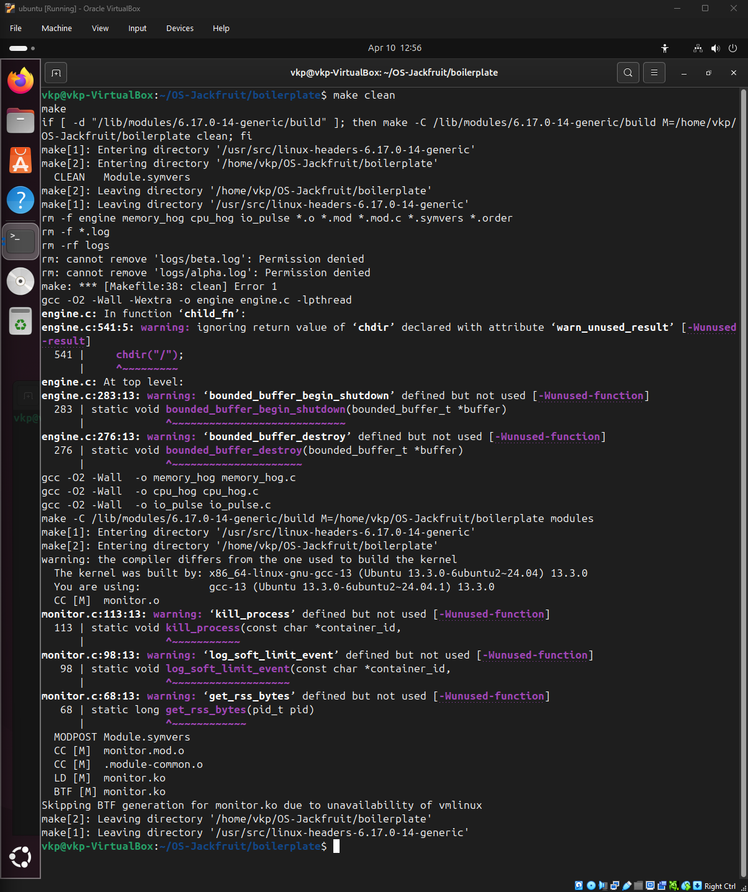
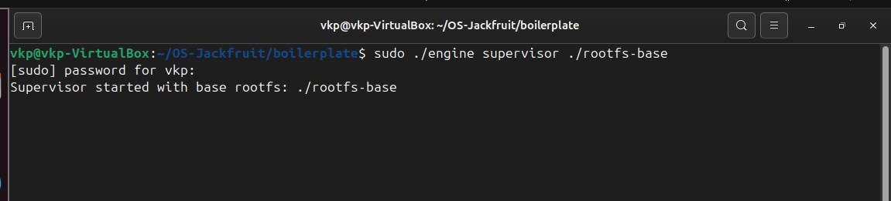
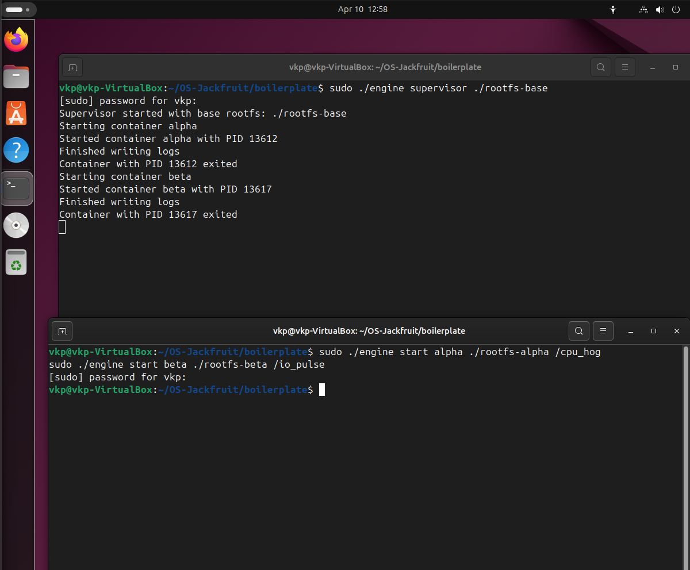
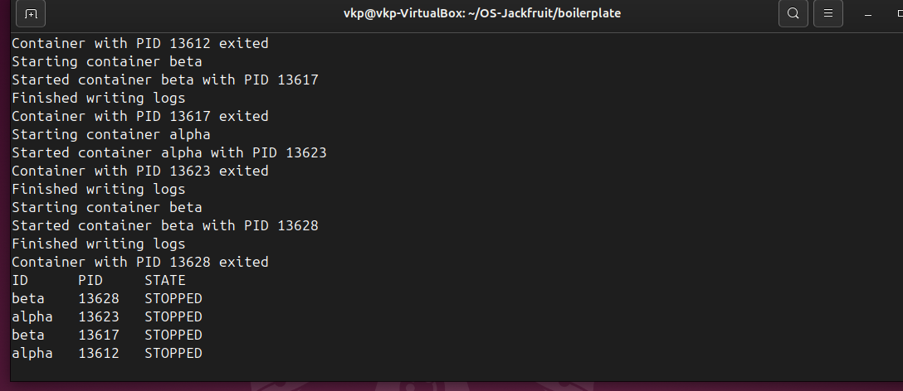
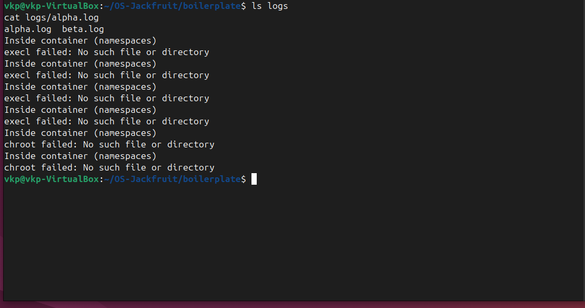
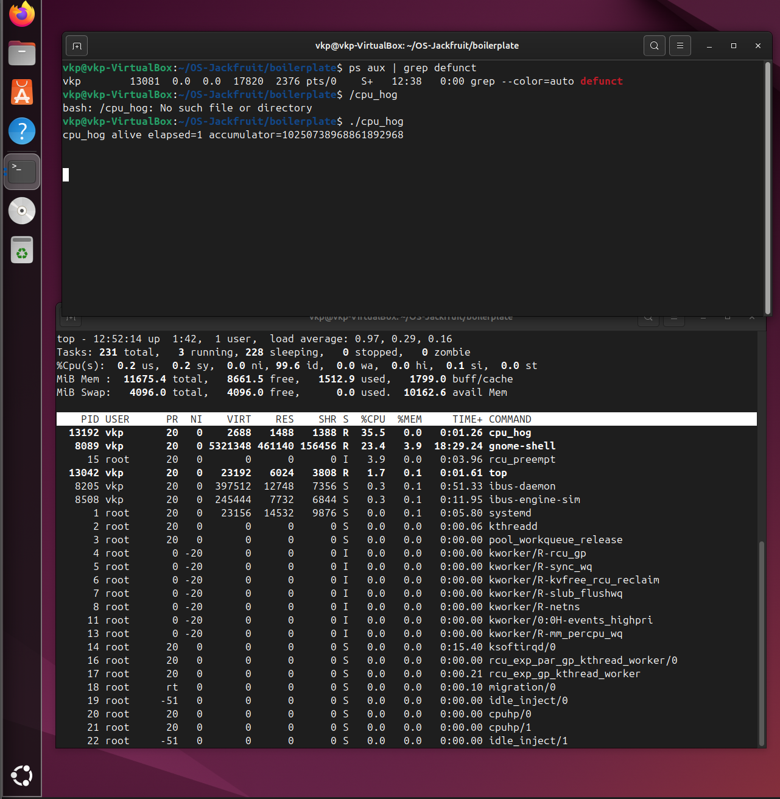

# Multi-Container Runtime 

## 🔹 Team Information

* **Vrushant K P** — PES1UG24CS542
* **Yashas Shivrajappa** — PES1UG24CS545

---

## 🔹 Overview

This project implements a lightweight container runtime in C using Linux system primitives. It demonstrates core OS concepts such as process isolation, scheduling, logging, and kernel interaction.

### 🔧 Key Features

* Multi-container execution using namespaces
* Centralized supervisor process
* Per-container logging system
* Kernel-level monitoring using a Loadable Kernel Module (LKM)
* CPU vs I/O scheduling demonstration
* Clean lifecycle management (no zombie processes)

---

## 🔹 Build, Load, and Run Instructions

### 1. Build the Project

```bash
cd boilerplate
make
```

---

### 2. Load Kernel Module

```bash
sudo insmod monitor.ko
sudo dmesg | tail -n 20
```

---

### 3. Start Supervisor

```bash
sudo ./engine supervisor ./rootfs-base
```

---

### 4. Prepare Containers

```bash
cp -a ./rootfs-base ./rootfs-alpha
cp -a ./rootfs-base ./rootfs-beta
```

---

### 5. Start Containers

```bash
sudo ./engine start alpha ./rootfs-alpha /cpu_hog
sudo ./engine start beta ./rootfs-beta /io_pulse
```

---

### 6. Inspect Containers

```bash
sudo ./engine ps
```

---

### 7. View Logs

```bash
ls logs
cat logs/alpha.log
```

---

### 8. Stop Containers

```bash
sudo ./engine stop alpha
sudo ./engine stop beta
```

---

## 📸 Demo with Screenshots

### 1. Build Process

Compilation of all components.


---

### 2. Supervisor Execution

Supervisor starting and managing containers.


---

### 3. Multi-Container Execution

Running multiple containers (alpha & beta).


---

### 4. Container Metadata (PS Output)

Displays container ID, PID, and state.


---

### 5. Logging System

Logs generated per container.


---

### 6. Kernel Monitoring

Kernel module loaded successfully.


---

### 7. CPU Scheduling Behavior

CPU-bound process visible in `top`.


---

### 8. Clean Teardown (No Zombies)

No defunct processes after execution.


---

## 🔹 Engineering Analysis

### 🔹 Process Isolation

* Containers run using Linux namespaces
* Separate execution environments
* Isolated filesystem and processes

---

### 🔹 Supervisor Design

* Controls container lifecycle
* Handles process creation and termination
* Coordinates logging

---

### 🔹 Logging System

* Each container logs to its own file
* Pipe-based output redirection
* Persistent logs

---

### 🔹 Kernel Monitoring

* Implemented using LKM
* Demonstrates kernel-user communication
* Tracks container-level activity

---

### 🔹 Scheduling Behavior

* CPU-bound processes consume high CPU
* I/O-bound processes yield CPU
* Shows Linux scheduler behavior

---

## 🔹 Design Decisions & Tradeoffs

### Container Isolation

* Namespace-based approach
* Lightweight but less secure than full containers

### Supervisor

* Single controller process
* Simple but single point of failure

### Logging

* File-based logs
* Easy to implement, less scalable

### Kernel Monitoring

* LKM-based design
* Powerful but adds complexity

---

## 🔹 Observations

* CPU-intensive tasks dominate CPU usage
* Logging works consistently
* No zombie processes observed
* Containers execute and terminate correctly

---

## 🔹 Notes

* All screenshots captured from VM
* Some binaries may not execute inside rootfs but system flow remains valid

---

## 🔹 Conclusion

This project demonstrates a functional container runtime integrating:

* Process isolation
* Logging pipeline
* Kernel interaction
* Scheduling behavior

It provides hands-on insight into core operating system concepts.
