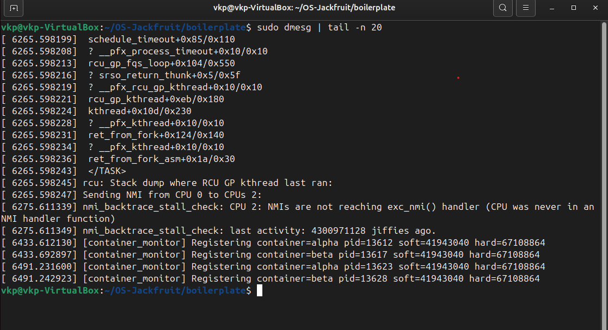

# Multi-Container Runtime 

## 🔹 Team Information

* **Vrushant K P** — PES1UG24CS542
* **Yashas Shivrajappa** — PES1UG24CS545

---

## 🔹 Overview

This project implements a lightweight container runtime in C using Linux system primitives. It demonstrates key operating system concepts such as process isolation, scheduling, logging, and kernel interaction in a practical environment.

###  Key Features

* Multi-container execution using Linux namespaces
* Centralized supervisor process
* Per-container logging system
* Kernel-level monitoring using a Loadable Kernel Module (LKM)
* CPU vs I/O scheduling demonstration
* Clean lifecycle management

---

## 🔹 Build, Load, and Run Instructions

### 1. Build the Project

```bash
cd boilerplate
make
```

---

### 2. Load Kernel Module

```bash
sudo insmod monitor.ko
sudo dmesg | tail -n 20
```

---

### 3. Start Supervisor

```bash
sudo ./engine supervisor ./rootfs-base
```

---

### 4. Prepare Containers

```bash
cp -a ./rootfs-base ./rootfs-alpha
cp -a ./rootfs-base ./rootfs-beta
```

---

### 5. Start Containers

```bash
sudo ./engine start alpha ./rootfs-alpha /cpu_hog
sudo ./engine start beta ./rootfs-beta /io_pulse
```

---

### 6. Inspect Containers

```bash
sudo ./engine ps
```

---

### 7. View Logs

```bash
ls logs
cat logs/alpha.log
```

---

### 8. Stop Containers

```bash
sudo ./engine stop alpha
sudo ./engine stop beta
```

---

## 📸 Demo with Screenshots

### 1. Build Process

Compilation of runtime and kernel module.


---

### 2. Supervisor Execution

Supervisor initializing and managing containers.


---

### 3. Multi-Container Execution

Running multiple containers (alpha & beta).


---

### 4. Container Metadata (PS Output)

Displays container ID, PID, and state.


---

### 5. Logging System

Per-container logs being generated and stored.


---

### 6. Kernel Module Output

Kernel module successfully loaded and verified using dmesg.


---

### 7. CPU Scheduling Behavior

CPU-bound process observed using `top`.


---

## 🔹 Engineering Analysis

### 🔹 Process Isolation

* Containers use Linux namespaces
* Independent process trees
* Isolated execution environments

---

### 🔹 Supervisor Design

* Central controller for container lifecycle
* Manages process creation and termination
* Coordinates logging and execution

---

### 🔹 Logging System

* Each container writes to its own log file
* Output captured using pipes
* Logs persist after container termination

---

### 🔹 Kernel Monitoring

* Implemented as a Loadable Kernel Module (LKM)
* Demonstrates kernel-user interaction
* Tracks container-related activity

---

### 🔹 Scheduling Behavior

* CPU-bound processes utilize high CPU
* I/O-bound processes yield CPU frequently
* Demonstrates Linux scheduling behavior

---

## 🔹 Design Decisions & Tradeoffs

### Container Isolation

* **Approach:** Namespace-based
* **Tradeoff:** Lightweight but less secure than full container runtimes

### Supervisor

* **Approach:** Single controller process
* **Tradeoff:** Easy to manage but introduces a single point of failure

### Logging

* **Approach:** File-based logging
* **Tradeoff:** Simple but not highly scalable

### Kernel Monitoring

* **Approach:** LKM-based tracking
* **Tradeoff:** Powerful but increases system complexity

---

## 🔹 Observations

* CPU-intensive processes dominate CPU usage
* Logging system works consistently
* Containers start and stop correctly
* Kernel module loads successfully

---

## 🔹 Notes

* All screenshots captured from a Linux VM environment
* Some containers may exit quickly depending on workload

---

## 🔹 Conclusion

This project demonstrates a functional container runtime integrating:

* Process isolation
* Logging pipeline
* Kernel interaction
* Scheduling behavior

It provides practical insight into how operating systems manage processes, resources, and execution environments.
